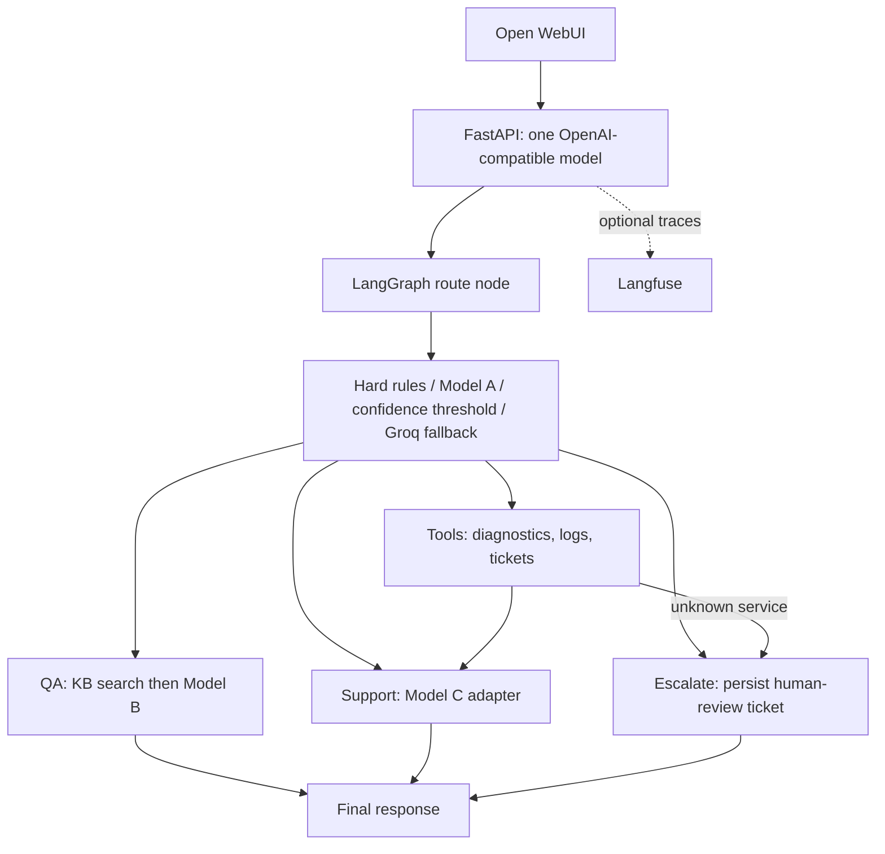

# Tuwaiq technical support agent

Application integration around the three existing trained models. Training,
datasets, artifacts, and saved evaluations are retained unchanged. The application
is implemented and runs locally; final deployment acceptance is still outstanding.
Read [design decisions](DESIGN_DECISIONS.md) and [validation results](VALIDATION.md)
for the known quality failures and checks that could not be completed.



## Local setup

Run from this directory with Python 3.14 and uv, following the existing lockfile:

```powershell
uv sync --locked
Copy-Item .env.example .env
```

Edit `.env`: set `API_KEY` to a private local key. Set `GROQ_API_KEY` and a
JSON-mode-capable `GROQ_MODEL` from your Groq account to enable ambiguous routing.
Without them, the app uses its documented support fallback. No OpenAI account or
`OPENAI_API_KEY` is required. Do not run the training scripts for setup.

Required existing artifacts:

| Role | Local artifact |
| --- | --- |
| Model A: six-label intent classification | `models/intent_classifier/model.safetensors`, config and tokenizer |
| Model B: extractive QA | `models/qa_model/model.safetensors`, config and tokenizer |
| Model C: support/synthesis | `models/support_adapter/adapter_model.safetensors`, adapter config and tokenizer |
| Model C original base | Cached `HuggingFaceTB/SmolLM2-135M-Instruct`, or `SUPPORT_BASE_MODEL` directory |

Weights and datasets are ignored by the existing Git configuration, so a fresh
checkout needs the existing artifact directories copied into place. Do not replace
or retrain them. Model A/B and the adapter load locally only. `LOCAL_FILES_ONLY=true`
also prevents downloading the base. If the original base is absent, supply it or
explicitly set `LOCAL_FILES_ONLY=false` to permit fetching that same base.

```powershell
uv run uvicorn src.api:app --host 0.0.0.0 --port 8000
```

Models and the KB index load lazily once per process. The first specialist request
is slower. Use one worker for this small deployment to avoid duplicate model RAM.
SQLite initializes its ticket table on first use. Existing QA contexts are read
from `data/model_b_dataset`; `docs/kb` holds local application documentation.

## Environment

All settings are centralized in `src/config.py`; `.env` is loaded without
overriding process variables. Paths are resolved relative to the repository.

| Variables | Purpose / default |
| --- | --- |
| `API_KEY` | Required bearer credential for `/v1/*`; empty means 503 |
| `GROQ_API_KEY`, `GROQ_MODEL` | Optional internal router credentials/model; both required for live fallback |
| `GROQ_BASE_URL`, `GROQ_TIMEOUT` | `https://api.groq.com/openai/v1`, 15 seconds |
| `LANGFUSE_PUBLIC_KEY`, `LANGFUSE_SECRET_KEY`, `LANGFUSE_HOST` | Optional tracing; default cloud host |
| `DATABASE_URL` | `sqlite:///data/mock_support.db`; also supports PostgreSQL |
| `MODEL_PATH`, `SUPPORT_BASE_MODEL` | `models`; optional local base-model override |
| `LOCAL_FILES_ONLY`, `MODEL_DEVICE` | `true`, `cpu` |
| `CLASSIFIER_THRESHOLD` | `0.80` |
| `QA_MIN_SCORE`, `KB_MIN_SCORE` | `0.05` span probability, `0.08` TF-IDF similarity |
| `MAX_NEW_TOKENS` | `192`, bounded to 512 |
| `KB_DATASET_PATH`, `KB_DOCS_PATH` | Existing `data/model_b_dataset`, `docs/kb` |
| `GOLDEN_SET_PATH` | Existing `data/golden_set.jsonl` |
| `POSTGRES_PASSWORD` | Compose database password; use URL-safe characters |
| `HF_CACHE_PATH` | Compose host cache directory, default `./.cache/huggingface` |

## API

`GET /health` is public liveness. `GET /v1/models` and
`POST /v1/chat/completions` require `Authorization: Bearer <API_KEY>`.
The sole model ID is `tuwaiq-tech-support-agent`.

```powershell
$headers = @{ Authorization = 'Bearer YOUR_API_KEY' }
Invoke-RestMethod http://localhost:8000/health
Invoke-RestMethod http://localhost:8000/v1/models -Headers $headers
$body = @{
  model = 'tuwaiq-tech-support-agent'
  messages = @(@{ role = 'user'; content = 'My API returns 503 after deployment.' })
  stream = $false
} | ConvertTo-Json -Depth 5
Invoke-RestMethod http://localhost:8000/v1/chat/completions -Method Post `
  -Headers $headers -ContentType 'application/json' -Body $body
```

Responses contain `id`, `object`, `created`, `model`, `choices`, `usage`, and
request/route/latency metadata. Usage is explicitly unmetered (zero counts).
`stream=true` returns buffered OpenAI-style SSE chunks and `[DONE]` after inference.
The app uses the last user message; full conversation memory and arbitrary
OpenAI request features are not implemented. Temperature does not change the
deterministic local generation settings.

## Routing and tools

Escalation rules take priority, followed by explicit documentation/live-system
rules, Model A at confidence >= 0.80, and validated Groq fallback. Invalid or
unavailable Groq output safely chooses support. Examples:

- “Production database may be corrupted after a failed migration.” -> escalation.
- “According to the deployment guide, which port must be exposed?” -> KB + Model B.
- “My PostgreSQL pool is at 98% and requests time out.” -> tools + Model C.
- “What is QLoRA?” -> support, with low-confidence routing fallback when needed.

All 13 tool contracts are available as schema-bearing objects in `src.tools.ALL_TOOLS`:

| Tools | Backend |
| --- | --- |
| `knowledge_base_search`, `documentation_search` | Real cached local TF-IDF search, source IDs and scores |
| `ticket_create`, `ticket_search`, `escalate_to_human` | Persistent SQLite/PostgreSQL records |
| `sql_query` | Two allowlisted read-only ticket SELECT queries |
| `calculator` | Bounded arithmetic AST; no `eval` |
| `log_analyzer` | ERROR/FATAL/EXCEPTION and WARN extraction |
| `diagnostic_runbook` | Health check then ticket lookup; unknown service -> human |
| `system_health_check` | Deterministic lab mock, explicitly labeled |
| `package_lookup`, `file_search`, `web_search` | Deterministic mocks with no invented facts |

The graph directly selects diagnostics, log analysis, ticket creation/search, KB,
and escalation where appropriate; it is not an unrestricted tool-calling agent.
All other contracts can be invoked directly with `.invoke({...})`. Escalation
records a ticket; it does not contact an external human or perform remediation.

## Tests and integration checks

```powershell
uv run pytest -q
uv run pytest --run-models -q
uv run python -m scripts.compare_routers
uv run python -m scripts.smoke_api
```

The default suite is offline, with mocked specialists/provider calls where needed
and real graph/API/SQLite execution. `--run-models` loads the real artifacts and
executes the unchanged 10-case Golden Set. It currently exits nonzero for G03/G06;
these are real generation failures, not skipped/xfail successes. A full run recorded
66 passes and 2 failures. Fast tests recorded 57 passes and 11 opt-in skips.

If a sandbox denies access to the default temporary directory, pass a fresh
workspace path such as `--basetemp=.cache/pytest-run-001`. Pytest clears the supplied
base directory, so use a dedicated test directory. The Golden Set must already
exist at `data/golden_set.jsonl`; the project does not recreate it.

`scripts.smoke_api` starts and stops an isolated localhost Uvicorn server with a
temporary test key and a separate `.cache` SQLite DB, exercises the four routes,
and saves actual responses to `reports/api_smoke.json`. The comparison script
saves a small router report, explicitly marking Groq unavailable when unconfigured.

## Docker and Open WebUI

Set `API_KEY`, `POSTGRES_PASSWORD`, and `HF_CACHE_PATH` in `.env`. Point
`HF_CACHE_PATH` at the existing Hugging Face cache containing the original base
model. On this Windows installation that is typically
`C:/Users/acer/.cache/huggingface`; use the appropriate path on your machine.
Compose mounts it at `/app/.cache/huggingface`. Keep container model/data paths
relative as shown in `.env.example`, rather than using Windows paths inside Linux.

```powershell
docker compose config --quiet
docker compose up --build
```

Services: `support-agent` on port 8000, `postgres:16` on the private Compose
network, and `open-webui` on port 3000. Tickets use PostgreSQL in Compose even
when local `.env` selects SQLite. Models are mounted read-only; data and the base
cache are mounted separately. The Docker command is exactly
`uvicorn src.api:app --host 0.0.0.0 --port 8000`.

Open `http://localhost:3000`. The configured connection is
`http://support-agent:8000/v1` with your application `API_KEY`. On an existing
WebUI volume, check Admin Settings -> Connections because saved settings can
override initial environment values. Select `tuwaiq-tech-support-agent` and send
the route examples above. Buffered SSE accommodates streaming clients.
WebUI's `OPENAI_API_KEYS` variable is its name for an upstream bearer credential;
it does not change the internal provider from Groq to OpenAI.

Compose schema validation passed. The actual image build reached dependency
installation but timed out fetching PyPI wheels. The full stack/WebUI connection
has not been verified; the image also retains the existing training dependencies
and is large. A fresh checkout does not include ignored model/data assets.

## Langfuse and deployment

Leave both Langfuse keys blank to disable telemetry. With keys configured, the
Langfuse 4 client uses `LANGFUSE_HOST` and a request-specific LangChain callback.
Graph decisions, named model calls, tool calls, final response, timing/errors,
and request/trace IDs are recorded. Application shutdown flushes pending events.
No credentials were available to verify a delivered trace.

For Dokploy, create a Compose application from this project, provide the existing
models/data/base cache and environment values, configure HTTPS domains for the API
and WebUI, then repeat `/health`, authenticated `/v1/models`, three chat examples,
and inspect the corresponding Langfuse traces. No Dokploy deployment was performed.

## Model quality and limitations

Existing saved results: Model A macro F1 **0.9933** (gate passes); Model B EM
**0.1240**, token F1 **0.4438** (saved overall gate fails); Model C loss improves
**3.2192 -> 2.8057**, but its original Golden Set regresses **4/10 -> 3/10**.
New application guards produce **8/10** on the same cases, with G03/G06 still
failing. These checks are heuristic; passing does not establish answer quality.

Model C can repeat text, misinterpret evidence, and give incorrect explanations.
Model B may abstain even on the deployment-port question. QA uses the top retrieved
passage; no-answer confidence is heuristic. Strict supplied-context-only requests
currently abstain conservatively. No live service monitoring, external ticket
notification, streaming token generation, calibrated routing confidence, or
multi-turn memory is provided. These are documented limits, not completed features.

Provider compatibility references: [Groq OpenAI compatibility](https://console.groq.com/docs/openai),
[Groq JSON output modes](https://console.groq.com/docs/structured-outputs),
[Open WebUI environment configuration](https://docs.openwebui.com/reference/env-configuration/).
